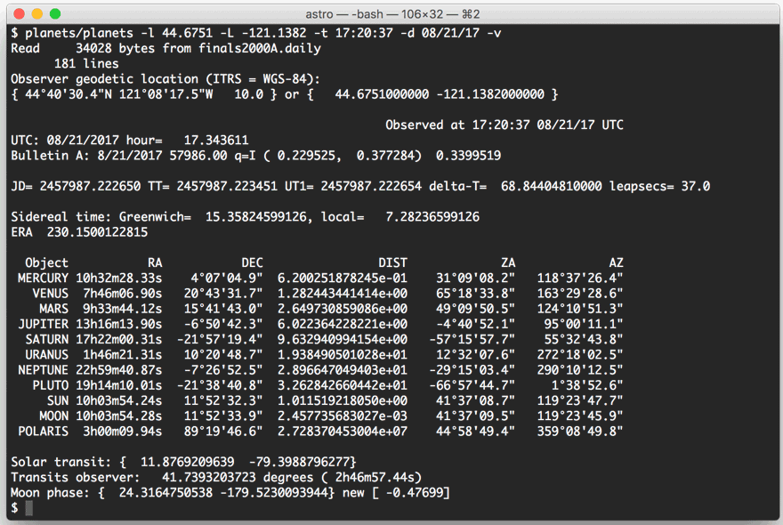

# astro

The astro project seeks to help programmers new to vector
astronomy work with the latest planetary ephemerides
published by the NASA Jet Propulsion Laboratory, using
the NOVAS-C library.

NOVAS-C and the JPL Ephemerides are free to download from the publishers.
Neither is provided here, although the Makefile downloads both.

Included in this project are two sample programs:

* `planets` -- Calculates the apparent position of the Sun
and planets from an observation point on Earth
* `tropical` -- Displays upcoming tropical moments (equinox and solstice)

### Basic vector astronomy using NOVAS

"The Naval Observatory Vector Astronomy Software (NOVAS) is a source-code
library in FORTRAN, C and Python that provides common astrometric quantities
and transformations. It can supply, in one or two function calls, the
instantaneous celestial position of any star or planet in a variety of
coordinate systems."
_NOVAS C 3.1 Guide_

This project uses the NOVAS-C library to calculate the sky positions of
the planets, Sun and Moon, from an observer at a fixed location on Earth;
and predicts future solstices and equinoxes.

The latest version of the library is NOVAS-C 3.1.
The Makefile also applies fixes for the two (as of 2019-Aug-12)
[known issues](https://aa.usno.navy.mil/software/novas/novas_faq.php)
in NOVAS-C 3.1.

This project uses the general purpose planetary ephemeris file DE430, published
15-Aug-2013 by the National Aeronautics and Space Administration
Jet Propulsion Laboratory (NASA JPL, or simply "JPL"). The JPL also publishes
the DE431 ephemeris which covers a time range of more than 30,000 years.
Those wishing to work with planetary positions more than 500 years ago, or 500 years
in the future, should download DE431.

More information about these JPL products is provided in
[The Planetary and Lunar Ephemerides DE430 and DE431](https://naif.jpl.nasa.gov/pub/naif/generic_kernels/spk/planets/de430_and_de431.pdf).

### NOVAS-C References

The United States Naval Observatory publishes NOVAS-C. More information is avaiable
at the following links:

[Naval Observatory Vector Astronomy Software](http://aa.usno.navy.mil/software/novas/novas_info.php)

[C Edition](http://aa.usno.navy.mil/software/novas/novas_c/novasc_info.php)

[Tarball](http://aa.usno.navy.mil/software/novas/novas_c/novasc3.1.tar.gz)


### Prerequisites

All distributions:

* patch
* gcc
* make

RHEL/CentOS/Fedora:

* curl
* libcurl-devel

Debian/Ubuntu:

* libcurl4
* libcurl4-openssl-dev

Additionally, there is an optional requirement on [kplot](https://kristaps.bsd.lv/kplot/) and [cairo](https://www.cairographics.org/). To enable building with these libraries, set `KPLOT` to a non-zero value, then run make.

```
export KPLOT=1
```

Cairo is available as Debian/Ubuntu package named `libcairo2-dev`. 

Kplot isn't available as a standard distribution package, but is easily installed from sources. Install to the default prefix, `/usr/local`. Astro was tested with kplot v0.1.15 and cairo v1.16.0.

The plots are only generated by `tropical`, and show the latitude of the solar transit point in the vicinity of the tropical moments. More plots are in the works for a future update.

## Build

The Makefile will manage downloading and patching the NOVAS-C library,
and the DE 430 or DE 431 ephemerides.

By default, the Makefile will select DE 430.

```
make
```

If you want to use DE 431, then issue the following command:

```
make DE=431
```

## Mac (Darwin) support

This project has been tested on MacOS, using gcc.

## Windows (WSL) support

This project has been tested on Windows 10, using the Windows Subsystem for Linux.
The tested WSL distribution was Debian.

# Building applications with NOVAS-C and JPL DE430

This project includes two very simple applications to illustrate
how to use NOVAS-C and JPL DE430. The features in these programs is
intentionally limited in order to reduce dependencies on platform-specific
and third-party libraries.

## Planets

The `planets` program displays the positions of the planets from an
observer on Earth.

```
planets/planets -h
watch planets/planets
```



## Tropical

The `tropical` program displays upcoming tropical moments
(equinox and solstice).

It uses the latitude of the subsolar point on Earth in its
calculations. A local maximum or minimum latitude is the
solstice, and the crossing of the Equator is the equinox.

```
tropical/tropical
```

The output will look like:
```
Ephemeris: JPL Planetary Ephemeris DE430/LE430
December solstice occurs at 2020-12-21 11:39:25 UTC
  Subsolar point: {23°26'13.7"S 4°43'09.3"E} [{-23.4371276537, 4.7192607927}]
March equinox occurs at 2021-03-20 09:36:58 UTC
  Subsolar point: {0°00'00.0"N 37°36'55.5"E} [{0.0000000003, 37.6154224069}]
June solstice occurs at 2021-06-21 04:14:10 UTC
  Subsolar point: {23°26'15.0"N 116°54'03.7"E} [{23.4375081716, 116.9010325250}]
September equinox occurs at 2021-09-22 19:20:13 UTC
  Subsolar point: {0°00'00.0"S 111°55'32.7"W} [{-0.0000000003, -111.9257542590}]
December solstice occurs at 2021-12-21 16:31:35 UTC
  Subsolar point: {23°26'15.3"S 68°20'03.6"W} [{-23.4375879062, -68.3343235616}]
March equinox occurs at 2022-03-20 15:33:45 UTC
  Subsolar point: {0°00'00.0"S 51°34'58.3"W} [{-0.0000000003, -51.5828667837}]
June solstice occurs at 2022-06-21 07:53:23 UTC
  Subsolar point: {23°26'16.4"N 62°05'57.1"E} [{23.4378819870, 62.0991819233}]
September equinox occurs at 2022-09-23 01:04:36 UTC
  Subsolar point: {0°00'00.0"S 161°58'55.1"E} [{-0.0000000005, 161.9819757694}]
```

# Citation and Further Reading

After cloning this repository and running the setup script, the
following file will be present:

`Cdist/NOVAS_C3.1_Guide.pdf`

That document provides the definitive reference to NOVAS-C, and is
therefore required reading if you want to get the best results.

Bangert, J., Puatua, W., Kaplan, G., Bartlett, J., Harris, W., Fredericks, A., & Monet, A. (2011) User's Guide to NOVAS Version C3.1 (Washington, DC: USNO).
